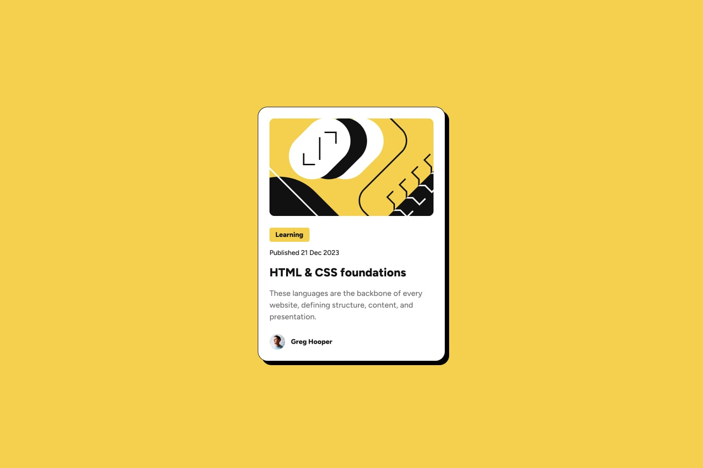

# Frontend Mentor - Blog preview card solution

<h1>
  Blog preview
</h1>

  <strong>A blog preview landing page built with semantic HTML and modern CSS. The project uses a mobile-first approach, responsive styling, and reusable design tokens to recreate the provided layout across mobile, tablet, and desktop breakpoints.</strong>

  🌐 <a href="https://squarebitz.github.io/blog-previews/"><strong>Live Demo</strong></a>

  
   
   
  📂 <a href="https://github.com/Squarebitz/blog-previews.git"><strong>Source Code</strong></a>
  &nbsp;|&nbsp;
  🎯 <a href="https://www.frontendmentor.io/solutions/blog-preview-page-0mgfDp6J6c"><strong>Challenge</strong></a>

<h2> Challenges </h2>

 
After writting the html first and i'm trying to adapt to mobille
first before desktop i didnt quite face much problem any feedback is welcome and i will appreciate that 

